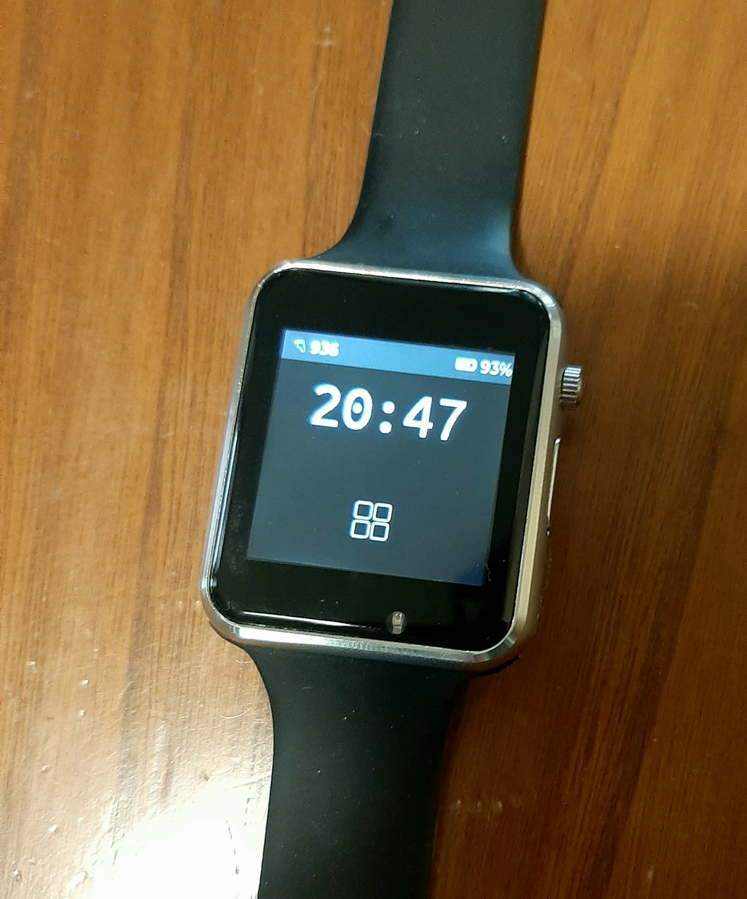

# AM_TWATCH_2020_V1

This code is derived from the SimpleWatch example of Xinyuan LilyGO TTGO_TWatch GitHub https://github.com/Xinyuan-LilyGO/TTGO_TWatch_Library

Smartwatch used is the T-Watch 2020v1 powered by esp32 SoC, available at following link: LILYGO® TTGO T-Watch-2020 ESP32 Main Chip 1.54 Inch Touch Display Programmable Wearable Environmental Interaction Module Board from Electronic Components & Supplies on banggood.com
https://banggood.app.link/cvdGdb5937
